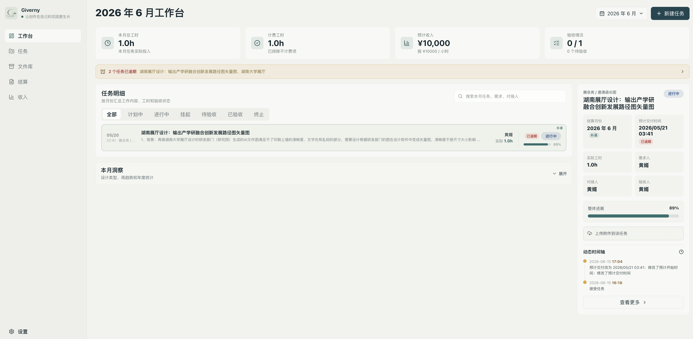
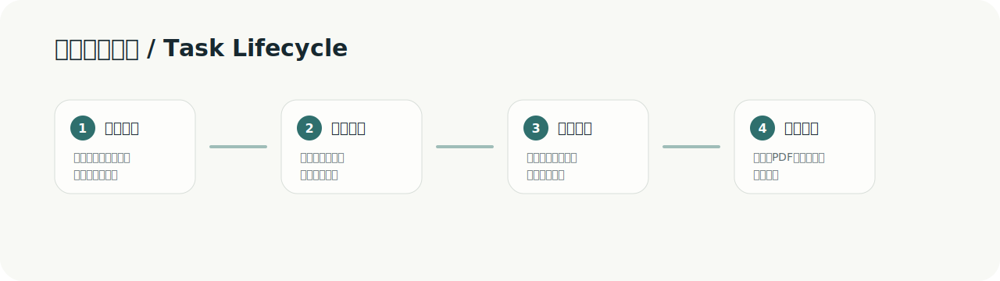
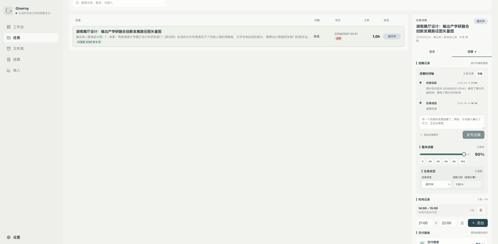
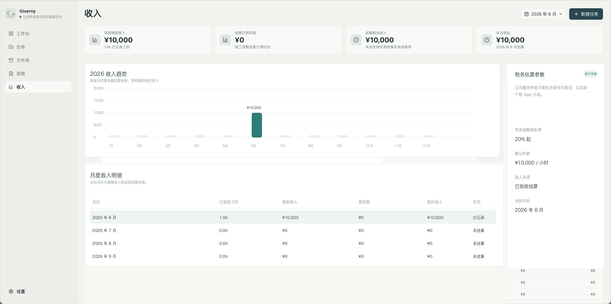
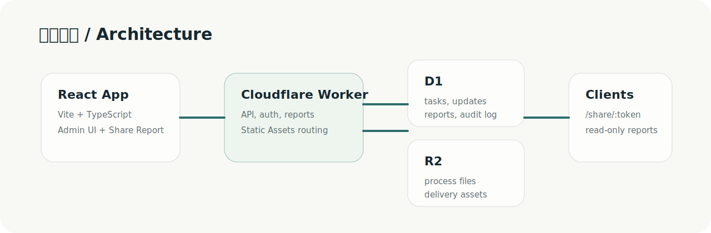

# Giverny

<p align="center">
  
</p>

<p align="center">
  <strong>A collaborative task workflow, time evidence, delivery acceptance, and monthly settlement platform for companies, freelance teams, and design-service work.</strong>
</p>

<p align="center">
  <a href="https://mayeai.com">Production mayeai.com</a>
  ·
  <a href="./使用手册.md">User Guide</a>
  ·
  <a href="./CHANGELOG.md">Changelog</a>
  ·
  <a href="https://github.com/avalonlucky/Giverny/releases">Releases</a>
</p>

<p align="center">
  <a href="./README.md">简体中文</a>
  ·
  <a href="./README.zh-TW.md">繁體中文</a>
  ·
  English
  ·
  <a href="./README.ja.md">日本語</a>
  ·
  <a href="./README.ko.md">한국어</a>
</p>

> **In one sentence:** Giverny is a task workflow and settlement workbench for companies, freelance teams, and design-service collaboration. It turns scattered requirements in chat, hours in Excel, files in cloud drives, verbal acceptance, and manual month-end reconciliation into one traceable business chain.

<p align="center">
  <a href="https://mayeai.com"><strong>Live Site</strong></a>
  ·
  <a href="#why-giverny">Why it exists</a>
  ·
  <a href="#core-workflow">Core workflow</a>
  ·
  <a href="#real-product-screenshots">Screenshots</a>
  ·
  <a href="#local-development">Run locally</a>
</p>



## What This Is

Giverny is not another generic project management tool. It is a lightweight operations back office for “collaborative tasks + time evidence + delivery acceptance + monthly settlement,” built for teams that need a complete trace from request to reconciliation across design, content, operations, outsourcing, or internal collaboration work.

It does not only ask whether a task moved to another board column. It asks whether each piece of work can clearly answer:

- Who requested it, who coordinated it, and when should it be delivered?
- What progress happened and which files were uploaded along the way?
- How many actual hours were spent, and which hours can be settled?
- Who accepted the final result, and what is the acceptance evidence?
- At month-end, can the team show tasks, hours, files, and amount without digging through chat history?

## Core Capabilities

| Capability | Problem Solved |
| --- | --- |
| Task workflow | Track work from planned, in progress, pending acceptance, to accepted |
| Process collaboration | Record progress, attachments, time segments, and a dynamic timeline on each task |
| Time management | Use actual hours as the only source for analytics, income, and settlement |
| Delivery acceptance | Review basic info, progress, segmented hours, files, and notes in a final review panel |
| Monthly settlement | Summarize hours, income, acceptance status, and annual trends by settlement month |
| Client reconciliation | Generate read-only links for clients to view reports, task details, and delivery files |
| File archive | Keep process files, acceptance attachments, and final drafts inside the task lifecycle |

## Suitable Scenarios

- Internal design, content, operations, or marketing tasks that require cross-person collaboration and monthly review.
- Freelance designers or outsourcing teams that need to record actual hours, delivery files, and settlement evidence.
- Managers who need to reconcile what was done, how long it took, what was delivered, and how much should be settled.
- Clients or collaborators who need a read-only page for monthly reports and delivery content instead of searching chat history.

## Contents

- [Positioning](#positioning)
- [Language Versions](#language-versions)
- [Why Giverny](#why-giverny)
- [Who It Is For](#who-it-is-for)
- [Typical Scenarios](#typical-scenarios)
- [Core Workflow](#core-workflow)
- [Real Product Screenshots](#real-product-screenshots)
- [Module Details](#module-details)
- [Roles and Permissions](#roles-and-permissions)
- [Data and Settlement Rules](#data-and-settlement-rules)
- [File Lifecycle](#file-lifecycle)
- [Technical Architecture](#technical-architecture)
- [Local Development](#local-development)
- [Deployment and Release](#deployment-and-release)
- [Documentation Index](#documentation-index)
- [FAQ](#faq)

## Positioning

Giverny is an operations back office for freelance design work. It keeps task requirements, design progress, actual hours, process files, acceptance attachments, monthly settlement, and client read-only reconciliation links in one system, reducing the repeated switching between chat history, spreadsheets, cloud drives, and manual month-end accounting.

It currently serves the production site [mayeai.com](https://mayeai.com). Production contains real operational data, with Cloudflare D1 storing business data and Cloudflare R2 storing uploaded files. The staging site has been retired; future features are verified locally and then updated directly to production.

Giverny is not a generic project management tool. It is closer to a design-service settlement workbench: it connects the lifecycle of design tasks with progress, hours, files, acceptance, and monthly reports.

## Language Versions

The top of the README provides native GitHub language entries: Simplified Chinese, Traditional Chinese, English, Japanese, and Korean. Each language opens a standalone Markdown README file instead of an external collection page.

All language versions should keep the same core explanation: what Giverny is, why it is not simply Notion / Feishu / Excel, the core workflow, key business rules, technical architecture, and release discipline.

## Why Giverny

The common problem in freelance design work is not the lack of task tools. The problem is that evidence is scattered across too many places:

- Requirements are in WeChat, Feishu, email, and verbal communication.
- Hours are in temporary Excel sheets or chat notes.
- Process files and final files are mixed in cloud drives or local folders.
- At month-end, the client mainly cares about what was done, how long it took, what was delivered, and why the amount should be settled.
- The designer also needs a record: when the request was accepted, when it changed, and which file is the final acceptance basis.

Giverny turns those scattered pieces into a traceable chain:

```text
Request -> Progress -> Time Record -> File Archive -> Delivery Acceptance -> Monthly Settlement -> Client Read-only Reconciliation
```

## Who It Is For

| Role | Main Need | What Giverny Provides |
| --- | --- | --- |
| Freelance designer | Clearly record each request, changes, actual hours, and acceptance files | Task details, progress timeline, segmented hours, acceptance attachments, monthly statistics |
| Design service owner | Reconcile workload, income, files, and settlement status by month | Dashboard, income statistics, file library, monthly reports, PDF export |
| Client / collaborator | View final monthly report, task details, and delivery files without entering the back office | Read-only `/share/:token` link |
| Incoming developer / AI coding assistant | Quickly understand code structure, business rules, and release discipline | `AGENTS.md`, `docs/`, `handoff/`, Releases |

## Typical Scenarios

### Scenario 1: Normal Task in the Current Month

1. Create a task in the current month and fill in the task name, design type, requirement, planned start, and planned delivery.
2. After accepting the task, record progress in the right-side Progress panel, for example: “confirmed dimensions, drafting first layout.”
3. When actual work needs to be recorded, add a time segment such as `09:00 - 10:30 first draft`.
4. Upload process attachments or final output files.
5. At delivery, expand Delivery Acceptance and review basic information, progress, hours, attachments, and notes.
6. After confirmation, the task enters this month’s hours, income, and monthly report.

### Scenario 2: Backfilled Historical Task

1. Enable “Supplement” when creating the task.
2. Keep the task date as the real occurrence date, for example May 20.
3. Choose the settlement month that should include the task, for example June 2026.
4. The client can see the public “Supplement” tag and understand why the task appears in the current month’s settlement.
5. Supplement is public explanatory information and must not be styled as admin-only brown information.

### Scenario 3: Finished but Not Accepted

1. Keep the status as “Pending Acceptance.”
2. Add actual hours, delivery attachments, and acceptance notes on the task detail side.
3. Click “Go to acceptance” to open the final review dialog.
4. After confirmation, the status becomes “Accepted,” progress automatically becomes 100%, and hours are locked into settlement.

### Scenario 4: Client Month-end Reconciliation

1. The admin locks the monthly data in Monthly Report / Settlement.
2. Generate a read-only sharing link.
3. The client views this month’s tasks, hours, delivery files, and settlement amount through the link.
4. The client page does not show back-office edit controls and cannot delete, modify, or accept tasks.

## Core Workflow



1. **Create task**: record task name, design type, requirement, planned start, planned delivery, contact person, and settlement month.
2. **Track progress**: record progress, upload process attachments, add time segments, maintain status, and update overall progress in the task’s right-side Progress panel.
3. **Accumulate hours**: all statistics are based on actual hours; planned start and planned delivery are scheduling references only and do not participate in analytics, hour calculation, or settlement.
4. **Delivery acceptance**: expand the acceptance panel and review basic information, progress, segmented hours, acceptance attachments, and notes. After confirmation, the status becomes “Accepted,” progress is locked to 100%, and hours enter settlement.
5. **Monthly settlement**: summarize hours, income, acceptance status, and annual trends by settlement month, then generate a read-only client link and PDF.

## Real Product Screenshots

These screenshots come from real production pages, not redrawn mockups. They show the current dashboard, task progress, income statistics, component density, status styles, and overall visual direction.

### Dashboard


### Tasks



### Income



## Module Details

### Dashboard

The dashboard is the monthly operations overview. Its core question is: how much was done this month, how much can be settled, and what is still pending acceptance?

It shows total monthly hours, billable hours, estimated income, acceptance status, overdue reminders, task details, monthly insights, and annual statistics.

Key rule: dashboard statistics are based on `settlement_month` and actual hours. Planned start / planned delivery are not used for settlement.

### Task Navigation

Task Navigation handles daily task maintenance. The left side is a list or calendar; the right side is the selected task detail panel.

The list supports status filters, task name, requirement summary, contact person, delivery time, hours, and status. Supplemental tasks show a public “Supplement” tag. Admins can use context menus for detail viewing, status changes, copying names, copying client links, voiding, or restoring tasks.

The right Information tab shows task name, design type, planned start, planned delivery, settlement month, requester, contact person, acceptor, and requirement. Planned start / delivery are schedule references only. Admin-only internal information uses brown `admin-only-data`.

The right Progress tab includes progress notes, process attachments, time records, overall progress with 10% steps and confirm-before-save behavior, a dynamic timeline, and delivery acceptance.

### Delivery Acceptance

Acceptance is the boundary between “work in progress” and “settlement.” The final review dialog asks users to check basic information, current progress, segmented hours, acceptance files, and optional notes.

After acceptance, the task becomes Accepted, actual hours are locked into settlement, progress becomes 100%, and the project is considered finished for dashboard, income, annual statistics, and monthly reports.

### File Library

The file library is not a separate cloud drive. It archives files from the task lifecycle: process files, progress attachments, acceptance attachments, and final drafts.

Files are organized by task and project. They can be previewed, opened, downloaded, renamed, tagged, or deleted when uploaded by mistake. Deletion must use in-app confirmation, clean D1 records, R2 source files and previews, and write an audit log.

### Income and Monthly Reports

The income page shows income trends and after-tax estimates. Monthly reports read locked monthly data and generate read-only links. Clients can see monthly task summaries, task details, hours, settlement amounts, delivery files, and PDF export content. Client links are read-only and provide no management actions.

### Settings

Settings manage access passcodes, design types, hourly rate and tax method, PDF header and service company name, account security, system version, Cloudflare bindings, and backup entry points.

## Roles and Permissions

| Capability | Admin | Passcode User | Client Share Link |
| --- | --- | --- | --- |
| View dashboard | Yes | Yes | No |
| Create / edit tasks | Yes | Limited or no, depending on passcode | No |
| Delete task dynamics | Yes | No | No |
| Upload / delete files | Yes | Limited | No |
| Confirm acceptance | Yes | No | No |
| Generate passcodes | Yes | No | No |
| View admin-only time information | Yes | No | No |
| View monthly reports and delivery files | Yes | Yes | Read-only |

Visual rules:

- Admin-only information uses brown `admin-only-data`.
- Supplement is a public explanation tag and uses a public green style.
- Client read-only pages do not show back-office buttons, delete entries, internal time, or management status.

## Data and Settlement Rules

### Month Ownership

Task month ownership only uses `settlement_month`. Normal tasks default to the currently selected month. Supplemental tasks can separate the real occurrence date from the settlement month. Dashboard, task list, income statistics, and monthly reports all use `settlement_month`.

### Actual Hours

Actual hours come from segmented time records, the actual hours confirmed during acceptance, and locked hours after acceptance. They are used for monthly insights, income estimates, monthly reports, annual statistics, and settlement PDFs.

### Planned Start / Planned Delivery

Planned start and planned delivery are only for scheduling and reminders. They can indicate due / overdue states and help sorting or calendar views, but they do not participate in hour statistics, income calculation, or settlement-month fallback.

## File Lifecycle

```text
Upload process file -> Enter file library -> Mark purpose / tags -> Acceptance attachment or final draft -> Monthly read-only share -> Long-term retention or manual cleanup
```

There is no automatic periodic cleanup yet because historical attachments may continue to be referenced by monthly reports, client share pages, retrospectives, or rework. In production, archiving should be preferred over direct deletion.

Recommended cleanup: clean after monthly report lock, keep final drafts / acceptance / contract / settlement files first, delete duplicate or mistaken uploads, and later add a three-stage mechanism such as pending archive / pending deletion / final cleanup.

## Technical Architecture



| Layer | Technology | Description |
| --- | --- | --- |
| Frontend | React 19, TypeScript, Vite | Back-office app and client share page |
| Styles | `src/App.css` | Single stylesheet; color and layout rules in `docs/DESIGN.md` |
| Backend | Cloudflare Worker | API, authentication, AI assistant, monthly reports, static routes |
| Database | Cloudflare D1 | Tasks, progress, attachments, reports, settings, audit logs |
| File Storage | Cloudflare R2 | Source files, previews, delivery attachments |
| Static Assets | Workers Static Assets | Frontend build output |
| Deployment | Wrangler | Production domain `mayeai.com` |

### Key Code Entry Points

| File | Purpose |
| --- | --- |
| `src/App.tsx` | Main back-office app, routing state, task management, settings |
| `src/App.css` | Global styles and component visual rules |
| `src/SharedReport.tsx` | Client read-only share page |
| `src/worker.ts` | Cloudflare Worker API and authentication |
| `src/lib/api.ts` | Frontend API client |
| `src/types/domain.ts` | Domain types for tasks, files, reports, and more |
| `src/config/appConfig.ts` | Version, default hourly rate, design types |
| `db/schema.sql` | Full D1 schema |
| `db/migrations/` | Historical migrations |

## Local Development

```bash
npm install
npm run dev
```

Default local address:

```text
http://127.0.0.1:5173/
```

Common checks:

```bash
npm run lint
npm run build
```

## Deployment and Release

Read [docs/DEPLOYMENT.md](./docs/DEPLOYMENT.md) before deployment. The project no longer maintains a staging site; after local verification, updates go directly to production.

```bash
env -u ALL_PROXY -u HTTPS_PROXY -u HTTP_PROXY -u all_proxy -u https_proxy -u http_proxy npm run deploy:worker
```

Production resources:

- Worker: `designer-worklog`
- D1: `designer-worklog-db`
- R2: `designer-worklog-uploads`
- Domains: `mayeai.com` / `www.mayeai.com`

Only website-impacting production updates need version bump, tag, and GitHub Release. README, repository homepage, multilingual docs, handoff, and internal collaboration docs only need normal commit / push.

For website-impacting updates: update app version files, update `CHANGELOG.md`, run lint and build, deploy and verify production, commit and push, create and push a tag, create a GitHub Release, and attach screenshots when UI / interaction changes are obvious.

## Documentation Index

- [User Guide](./使用手册.md): daily usage and operations.
- [Changelog](./CHANGELOG.md): version history since `v0.10.0`.
- [Design Guide](./docs/DESIGN.md): visual hierarchy, colors, and component rules.
- [UX Optimization Audit](./docs/UX_OPTIMIZATION_AUDIT.md): interaction flows and operation paths.
- [Operation Policies](./docs/OPERATION_POLICIES.md): sorting, file cleanup, release, and data safety rules.
- [Project Structure](./docs/PROJECT_STRUCTURE.md): directories, modules, and entry points.
- [Versioning Guide](./docs/VERSIONING.md): version, Release, and publishing discipline.
- [Deployment Guide](./docs/DEPLOYMENT.md): Cloudflare production deployment.
- [Handoff](./handoff/HANDOFF.md): required reading before the next developer or AI takes over.

## FAQ

### Why not just use Notion / Feishu sheets / Excel?

Those tools can store information, but it is hard to reliably connect progress, actual hours, attachments, acceptance, settlement, and client read-only links into one auditable chain. Giverny’s value is the dedicated constraints around design-service settlement.

### Why can’t tasks be directly deleted?

Tasks affect hours, income, monthly reports, and historical reconciliation. Direct deletion can damage history. Abnormal tasks should use suspended, terminated, or voided states to preserve explanation.

### Why does planned delivery not participate in settlement?

Planned time is a plan, not work input. Settlement must be based on actual hours and acceptance status. Planned start / delivery are only for reminders, sorting, and scheduling reference.

### Why should supplemental tasks be visible to clients?

Supplement explains why a task appears in the current month’s settlement. If hidden, the client may think a new task appeared out of nowhere.

### Why is admin-only information brown?

Brown is the internal back-office marker. When admins see brown text, they know that information will not appear to regular members, client previews, or public read-only links.
