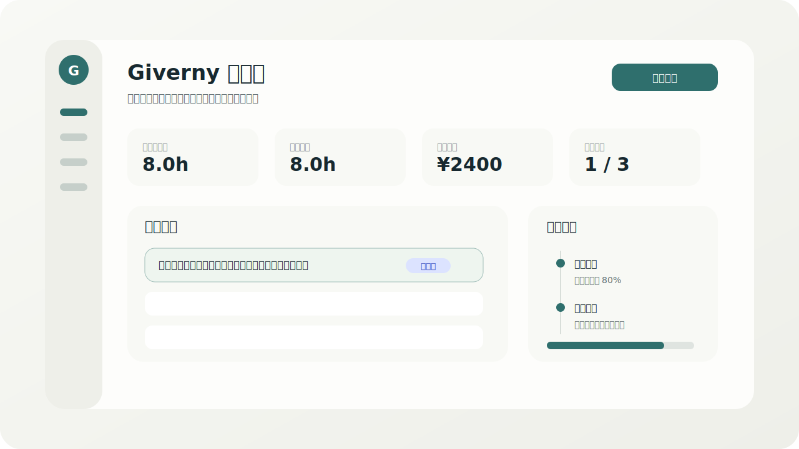

# Giverny

<p align="center">
  
</p>

<p align="center">
  <strong>面向兼职设计师与轻量设计服务团队的任务、工时、文件与月度结算平台。</strong>
</p>

<p align="center">
  <a href="https://mayeai.com">正式站 mayeai.com</a>
  ·
  <a href="./使用手册.md">使用手册</a>
  ·
  <a href="./CHANGELOG.md">更新日志</a>
  ·
  <a href="https://github.com/avalonlucky/Giverny/releases">Releases</a>
</p>

<p align="center">
  
  
  
</p>

> English readers: see [English Overview](#english-overview).



## 一句话介绍

Giverny 是一个用于管理设计兼职工作的运营后台：把任务需求、设计过程、实际工时、过程文件、验收附件、月度结算和甲方只读对账链接放在同一个系统里，减少“聊天记录里找需求、表格里算工时、网盘里找文件”的反复切换。

它目前服务于正式站 [mayeai.com](https://mayeai.com)，数据使用 Cloudflare D1 / R2 保存；后续不再维护预发布测试站，功能完成本地验证后直接更新正式站。

## 适合谁

- 兼职设计师：记录每一项需求、过程修改、实际工时和验收文件。
- 设计服务负责人：按月核对任务、工时、收入、文件和结算状态。
- 甲方或协作方：通过只读链接查看月报、任务明细和交付文件，不进入后台。
- AI 编码助手 / 接手开发者：通过 `AGENTS.md`、`docs/`、`handoff/` 快速理解项目规则和发布纪律。

## 核心工作流


1. 新建任务：记录任务名称、设计类型、需求说明、预计开始 / 预计交付、对接人和结算月份。
2. 过程推进：在任务右侧“进展”面板记录进展、上传过程附件、追加时间段、维护状态和整体进度。
3. 工时沉淀：所有统计以“实际工时”为准；预计开始时间和预计交付时间只用于排期参考，不参与数据分析、工时计算或结算。
4. 交付验收：展开交付验收面板，核对基础信息、进度、分段工时、验收附件和备注；确认后状态变为“已验收”，进度锁定为 100%，工时计入结算。
5. 月度结算：按结算月份汇总工时、收入、验收情况和年度趋势，生成只读甲方链接和 PDF。

## 功能总览

| 模块 | 用途 | 关键能力 |
| --- | --- | --- |
| 工作台 | 查看当月整体经营状态 | 总工时、计费工时、预计收入、验收情况、本月洞察、年度统计 |
| 任务导航 | 管理所有设计任务 | 列表 / 日历视图、状态筛选、右侧信息与进展面板、右键操作 |
| 进展记录 | 记录任务执行过程 | 过程记录、进展附件、时间段、整体进度草稿确认、动态时间轴 |
| 交付验收 | 完成最终确认 | 终审弹窗、分段工时核对、验收附件、验收备注、结算锁定 |
| 文件库 | 汇总任务文件资产 | 过程文件、进展附件、验收附件、最终稿，按任务归档 |
| 收入 | 查看收入趋势 | 月度收入、年度趋势、工资薪金 / 劳务报酬税后估算 |
| 月报 | 对账和交付 | 锁定月度结算、生成甲方只读链接、导出 PDF |
| 设置 | 管理平台参数 | 口令、设计类型、时薪、计税方式、PDF 抬头、版本信息 |

## 重要业务规则

- 任务不允许直接删除。异常任务用“挂起”或“终止”，并填写原因。
- 文件可以删除，仅用于清理误传文件；删除前必须使用站内确认弹窗，禁止浏览器原生 `alert` / `confirm` / `prompt`。
- 甲方没有后台权限，只能通过 `/share/:token` 只读浏览月报、任务明细和交付文件。
- 任务归属月份只使用 `settlement_month`；预计开始时间和预计交付时间只作为排期参考。
- 补录任务是公开解释标记，甲方需要看见；不要把“补录”做成管理员专属棕色信息。
- 管理员专属信息统一使用棕色 `admin-only-data`，普通成员、甲方预览和公开只读链接不可见。
- 每次正式更新必须完成：代码提交、推送、版本 tag、GitHub Release 更新日志；明显 UI 更新要按需附截图或动图。

## 技术架构


| 层级 | 技术 |
| --- | --- |
| 前端 | React 19、TypeScript、Vite |
| 样式 | 单文件 `src/App.css`，设计规则见 `docs/DESIGN.md` |
| 后端 | Cloudflare Worker |
| 数据库 | Cloudflare D1 |
| 文件存储 | Cloudflare R2 |
| 静态资源 | Workers Static Assets |
| 部署 | `wrangler deploy`，正式域名 `mayeai.com` |

## 快速开始

```bash
npm install
npm run dev
```

默认本地地址：

```text
http://127.0.0.1:5173/
```

常用检查：

```bash
npm run lint
npm run build
```

## 部署

部署前请阅读 [docs/DEPLOYMENT.md](./docs/DEPLOYMENT.md)。当前项目不再维护 staging 站，完成本地验证后直接部署正式站。

```bash
env -u ALL_PROXY -u HTTPS_PROXY -u HTTP_PROXY -u all_proxy -u https_proxy -u http_proxy npm run deploy:worker
```

生产资源：

- Worker：`designer-worklog`
- D1：`designer-worklog-db`
- R2：`designer-worklog-uploads`
- 域名：`mayeai.com` / `www.mayeai.com`

## 目录入口

```text
src/App.tsx              后台主应用
src/App.css              全站样式
src/SharedReport.tsx     甲方只读分享页
src/worker.ts            Cloudflare Worker 后端 API
src/lib/api.ts           前端 API client
src/lib/psdPreview.ts    PSD 预览辅助逻辑
src/types/domain.ts      领域类型
src/config/appConfig.ts  版本、默认设置、设计类型
db/schema.sql            完整 D1 schema
db/migrations/           历史迁移
docs/                    规范和运营文档
handoff/                 接手说明和本地环境样例
```

## 文档索引

- [使用手册](./使用手册.md)：日常使用和运营说明。
- [更新日志](./CHANGELOG.md)：从 `v0.10.0` 开始的版本记录。
- [设计规范](./docs/DESIGN.md)：UI 视觉层级、颜色和组件规则。
- [交互优化审计](./docs/UX_OPTIMIZATION_AUDIT.md)：交互流程和操作路径规范。
- [项目结构](./docs/PROJECT_STRUCTURE.md)：目录、模块和关键入口。
- [版本规范](./docs/VERSIONING.md)：版本号、Release 和发布纪律。
- [部署说明](./docs/DEPLOYMENT.md)：Cloudflare 正式站部署流程。
- [交接文档](./handoff/HANDOFF.md)：下一位开发者或 AI 接手前必读。

## English Overview

Giverny is a lightweight worklog and settlement platform for freelance designers and small design-service teams. It keeps design tasks, requirements, progress notes, actual working hours, delivery files, acceptance evidence, monthly settlement, and client read-only reports in one place.

### Who it is for

- Freelance designers who need reliable task, hour, and file tracking.
- Design-service operators who reconcile monthly work and income.
- Clients who only need a read-only monthly report and delivery files.
- Developers or AI coding agents who need a documented project with clear release discipline.

### Main capabilities

- Monthly dashboard with actual hours, billable hours, estimated income, acceptance status, and insights.
- Task management with list/calendar views, status filters, and a right-side detail panel.
- Progress timeline with progress notes, attachments, time entries, status changes, and admin-only timestamps.
- Acceptance workflow that locks actual hours into settlement and moves progress to 100%.
- File library that groups process files, progress attachments, acceptance files, and final deliverables by task.
- Share links for client-side read-only monthly reports.
- Cloudflare-native deployment using Workers, D1, R2, and Workers Static Assets.

### Development

```bash
npm install
npm run dev
npm run lint
npm run build
```

Production is deployed to [mayeai.com](https://mayeai.com). See [docs/DEPLOYMENT.md](./docs/DEPLOYMENT.md) before deploying.
