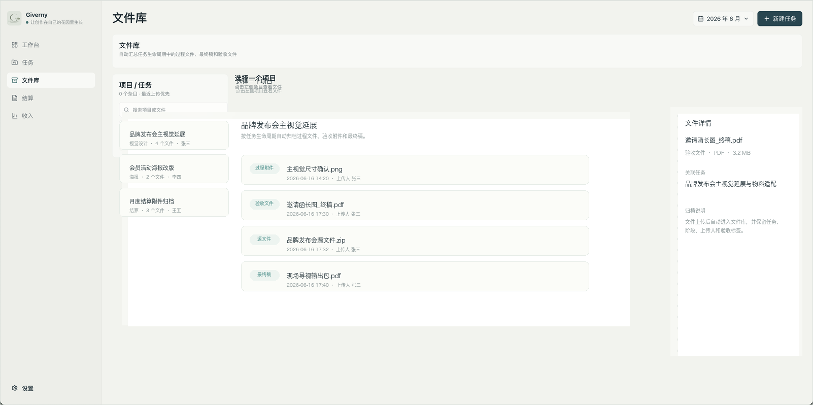
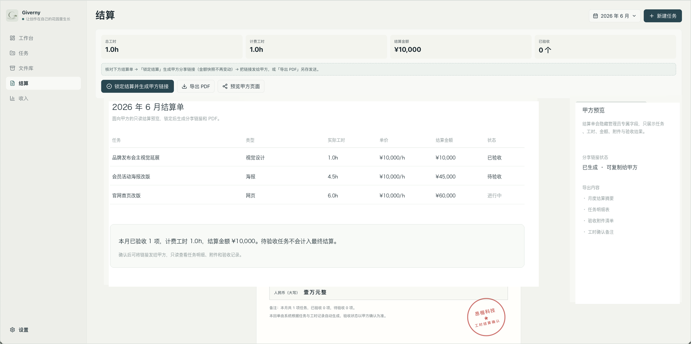

# Giverny

<p align="center">
  
</p>

<p align="center">
  <strong>面向兼职设计师与轻量设计服务团队的任务、工时、文件、验收和月度结算平台。</strong>
</p>

<p align="center">
  <a href="https://mayeai.com">正式站 mayeai.com</a>
  ·
  <a href="./使用手册.md">使用手册</a>
  ·
  <a href="./CHANGELOG.md">更新日志</a>
  ·
  <a href="https://github.com/avalonlucky/Giverny/releases">Releases</a>
</p>

<p align="center">
  
  
  
</p>

> English readers: see [English Overview](#english-overview).
> 下面截图来自正式站真实界面，任务名称、需求、人名和动态细节已替换为示例数据。


## 目录

- [项目定位](#项目定位)
- [为什么需要 Giverny](#为什么需要-giverny)
- [典型使用场景](#典型使用场景)
- [核心工作流](#核心工作流)
- [真实产品截图](#真实产品截图)
- [模块详解](#模块详解)
- [角色与权限](#角色与权限)
- [数据口径与结算规则](#数据口径与结算规则)
- [文件生命周期](#文件生命周期)
- [技术架构](#技术架构)
- [本地开发](#本地开发)
- [部署与发布](#部署与发布)
- [文档索引](#文档索引)
- [English Overview](#english-overview)

## 项目定位

Giverny 是一个用于管理设计兼职工作的运营后台。它把任务需求、设计过程、实际工时、过程文件、验收附件、月度结算和甲方只读对账链接放在同一个系统里，减少“聊天记录里找需求、表格里算工时、网盘里找文件、月底再手工做账”的反复切换。

它目前服务于正式站 [mayeai.com](https://mayeai.com)。正式站只放真实运营数据，使用 Cloudflare D1 保存业务数据，使用 Cloudflare R2 保存上传文件。预发布测试站已经下线，后续功能完成本地验证后直接更新正式站。

Giverny 不是泛用项目管理工具。它更偏向一个“设计服务结算工作台”：围绕设计任务的生命周期，把过程、工时、文件、验收和月报串起来。

## 为什么需要 Giverny

设计兼职工作常见的问题不是“没有任务管理工具”，而是信息被拆散在太多地方：

- 需求在微信、飞书、邮件和口头沟通里。
- 工时在临时 Excel 或聊天备注里。
- 过程文件和最终稿混在网盘或本地文件夹里。
- 甲方月底只关心“做了什么、花了多久、交付了什么、为什么要结算这笔钱”。
- 设计师自己又需要留痕：什么时候接的需求，什么时候改过，哪个文件是最终验收依据。

Giverny 的目标是把这些分散信息收敛成一条可追溯链路：

```text
任务需求 → 过程进展 → 时间记录 → 文件归档 → 交付验收 → 月度结算 → 甲方只读对账
```

## 适合谁

| 角色 | 主要诉求 | Giverny 提供什么 |
| --- | --- | --- |
| 兼职设计师 | 清楚记录每项需求、过程修改、实际工时和验收文件 | 任务详情、进展时间轴、分段工时、验收附件和月度统计 |
| 设计服务负责人 | 按月核对工作量、收入、文件和结算状态 | 工作台、收入统计、文件库、月报和 PDF |
| 甲方 / 协作方 | 只看最终月报、任务明细和交付文件，不进入后台 | `/share/:token` 只读链接 |
| 接手开发者 / AI 编码助手 | 快速理解代码结构、业务规则和发布纪律 | `AGENTS.md`、`docs/`、`handoff/`、Releases |

## 典型使用场景

### 场景 1：本月正常任务

1. 在当前月份新建任务，填写任务名称、设计类型、需求、预计开始和预计交付。
2. 接受任务后在右侧“进展”面板记录过程，例如“已确认尺寸，正在出草图”。
3. 需要记录实际投入时，添加时间段，例如 `09:00 - 10:30 初稿`。
4. 上传过程附件或最终输出文件。
5. 到交付时展开“交付验收”，核对基础信息、进度、工时、附件和备注。
6. 确认验收后，任务计入本月工时、收入和月报。

### 场景 2：补录历史任务

1. 新建任务时打开“补录”。
2. 任务日期仍填写真实发生时间，例如 5 月 20 日。
3. 结算月份选择需要计入的月份，例如 2026 年 6 月。
4. 甲方看到“补录”标记后，就能理解这条任务为什么出现在本月结算中。
5. 补录是公开解释信息，不能做成管理员专属棕色信息。

### 场景 3：任务已做完但还没验收

1. 状态保持“待验收”。
2. 在任务右侧补充实际工时、交付附件和验收备注。
3. 点击“去验收”打开终审弹窗。
4. 确认后状态变为“已验收”，进度自动到 100%，工时锁定并进入结算。

### 场景 4：甲方月底对账

1. 管理员在“月报 / 结算”里锁定月度数据。
2. 生成只读分享链接。
3. 甲方通过链接查看本月任务、工时、交付文件和结算金额。
4. 甲方页面不显示后台编辑入口，也不能删除、修改或验收任务。

## 核心工作流


1. **新建任务**：记录任务名称、设计类型、需求说明、预计开始、预计交付、对接人和结算月份。
2. **过程推进**：在任务右侧“进展”面板记录进展、上传过程附件、追加时间段、维护状态和整体进度。
3. **工时沉淀**：所有统计以“实际工时”为准；预计开始时间和预计交付时间只用于排期参考，不参与数据分析、工时计算或结算。
4. **交付验收**：展开交付验收面板，核对基础信息、进度、分段工时、验收附件和备注；确认后状态变为“已验收”，进度锁定为 100%，工时计入结算。
5. **月度结算**：按结算月份汇总工时、收入、验收情况和年度趋势，生成只读甲方链接和 PDF。

## 真实产品截图

这些截图来自正式站真实页面，不是重新绘制的示意图。为了适合公开仓库展示，任务名称、具体需求、人员姓名和动态细节已替换为示例数据；页面布局、组件密度、状态样式和整体视觉保持真实。

### 工作台


### 任务导航


### 文件库



### 结算



### 收入


## 模块详解

### 工作台

工作台是每个月的运营总览，核心问题是：“这个月做了多少、能结算多少、哪些还没验收？”

它展示：

- 本月总工时：本月任务实际投入工时。
- 计费工时：已验收或符合结算口径的工时。
- 预计收入：按设置中的时薪计算。
- 验收情况：已验收 / 总任务数，以及待验收数量。
- 逾期提醒：把预计交付已过期的任务集中提示。
- 任务明细：按状态筛选本月任务。
- 本月洞察：基于实际工时生成设计类型分布和周趋势。
- 年度统计：按月汇总全年工时与收入。

关键口径：工作台所有统计都基于 `settlement_month` 和实际工时，不使用预计开始 / 预计交付参与结算。

### 任务导航

任务导航负责日常维护任务。左侧是列表或日历，右侧是选中任务的详情。

列表侧：

- 支持“全部 / 计划中 / 进行中 / 挂起 / 待验收 / 已验收 / 终止”筛选。
- 展示任务名、需求摘要、对接人、交付时间、工时和状态。
- 补录任务会显示公开“补录”标签。
- 管理员可通过右键菜单查看详情、变更状态、复制任务名、复制甲方分享链接、作废或恢复任务。

右侧信息页：

- 展示任务名称、设计类型、预计开始、预计交付、结算月份、需求人、对接人、验收人和任务需求。
- 预计开始 / 预计交付只用于排期，不参与统计和结算。
- 只给管理员看的内部信息使用棕色 `admin-only-data`。

右侧进展页：

- 过程记录：记录“现在做到哪一步”。
- 进展附件：上传过程文件或沟通附件。
- 时间记录：添加分段工时，例如初稿、终稿、修改。
- 整体进展：以 10% 档位调整，先进入未保存草稿，确认后才写入时间轴。
- 动态时间轴：记录任务状态、进度、附件、排期等变更。
- 交付验收：项目收尾时展开，进入终审确认。

### 交付验收

验收是任务从“过程”进入“结算”的边界。终审弹窗用于让用户逐项核对：

- 基础信息：任务名称、设计类型、对接人、预计开始、预计交付、任务需求。
- 进度：显示当前完成百分比；确认验收后自动设置为 100%。
- 分段工时：可以核对或修改每段时间，最终得到实际工时合计。
- 验收附件：上传验收证明文件或最终交付文件。
- 验收备注：记录补充说明。

确认验收后：

- 状态变为“已验收”。
- 实际工时锁定进入结算。
- 进度变为 100%。
- 本项目结束，并计入工作台、收入、年度统计和月报。

### 文件库

文件库不是独立网盘，而是任务生命周期的文件归档视图。文件来源包括：

- 任务过程文件。
- 进展附件。
- 验收附件。
- 最终稿。

文件会按任务和项目归档，支持预览、打开源文件、下载、重命名、添加标签和删除误传文件。

删除规则：

- 只用于清理误传、重复上传或无价值临时文件。
- 删除必须使用站内二次确认。
- 删除会清理 D1 附件记录、R2 源文件和预览图。
- 删除动作写入审计日志。

### 收入与月报

收入页用于查看收入趋势和税后估算。月报用于对账和分享。

月报会读取锁定月份的数据，生成只读链接。甲方通过链接可以看到：

- 月度任务汇总。
- 任务明细。
- 工时和结算金额。
- 交付文件。
- PDF 导出内容。

甲方链接是只读的，不提供任何管理操作。

### 设置

设置页管理平台参数：

- 口令管理：生成和管理访问口令。
- 设计类型：维护设计类型大类和子类。
- 时薪与计税方式：影响收入估算。
- PDF 抬头与服务公司名称：影响结算回单展示。
- 账号安全：修改管理员密码。
- 系统信息：查看版本、Cloudflare 绑定和备份入口。

## 角色与权限

| 能力 | 管理员 | 访问口令用户 | 甲方分享链接 |
| --- | --- | --- | --- |
| 查看工作台 | 是 | 是 | 否 |
| 新建 / 编辑任务 | 是 | 受限或否，按当前口令权限 | 否 |
| 删除任务动态 | 是 | 否 | 否 |
| 上传 / 删除文件 | 是 | 受限 | 否 |
| 确认验收 | 是 | 否 | 否 |
| 生成访问口令 | 是 | 否 | 否 |
| 查看管理员专属时间信息 | 是 | 否 | 否 |
| 查看月报和交付文件 | 是 | 是 | 只读 |

视觉规则：

- 管理员专属信息使用棕色 `admin-only-data`。
- 补录是公开解释标记，使用绿色公开提示样式。
- 甲方只读页面不显示后台按钮、删除入口、内部时间和管理状态。

## 数据口径与结算规则

### 月份归属

任务归属月份只看 `settlement_month`。这意味着：

- 普通任务默认归属顶部当前选择的月份。
- 补录任务可以把真实发生日期和结算月份分开。
- 工作台、任务列表、收入统计、月报都按 `settlement_month` 统计。

### 实际工时

实际工时来自：

- 分段时间记录汇总。
- 验收时确认的实际工时。
- 已验收任务锁定后的工时。

实际工时会参与：

- 本月洞察。
- 收入估算。
- 月报。
- 年度统计。
- 结算 PDF。

### 预计开始 / 预计交付

预计开始时间和预计交付时间只用于排期与提醒：

- 可以用于判断临期 / 逾期。
- 可以帮助任务排序和日历查看。
- 不参与工时统计。
- 不参与收入计算。
- 不参与结算月份兜底。

## 文件生命周期

```text
上传过程文件 → 自动进入文件库 → 标记用途 / 标签 → 验收附件或最终稿 → 月报只读分享 → 长期保留或人工清理
```

当前没有自动定期清理机制。原因是历史附件可能被月报、甲方分享页、复盘或返修继续引用。正式运营阶段建议优先“归档”而不是直接删除。

推荐清理策略：

1. 月报锁定后再清理。
2. 最终稿、验收附件、合同或结算相关文件优先保留。
3. 重复上传、误传文件可以删除。
4. 大型过程源文件后续可增加“待归档 / 待删除 / 最终清理”三段式机制。

## 技术架构


| 层级 | 技术 | 说明 |
| --- | --- | --- |
| 前端 | React 19、TypeScript、Vite | 后台主应用和甲方分享页 |
| 样式 | `src/App.css` | 单文件样式，颜色和布局规则见 `docs/DESIGN.md` |
| 后端 | Cloudflare Worker | API、鉴权、AI 助手、月报和静态资源路由 |
| 数据库 | Cloudflare D1 | 任务、进展、附件、月报、设置、审计日志 |
| 文件存储 | Cloudflare R2 | 原始文件、预览图、交付附件 |
| 静态资源 | Workers Static Assets | 前端构建产物 |
| 部署 | Wrangler | 正式域名 `mayeai.com` |

### 关键代码入口

| 文件 | 用途 |
| --- | --- |
| `src/App.tsx` | 后台主应用、路由状态、任务管理、设置页 |
| `src/App.css` | 全站样式和组件视觉规则 |
| `src/SharedReport.tsx` | 甲方只读分享页 |
| `src/worker.ts` | Cloudflare Worker API 和鉴权 |
| `src/lib/api.ts` | 前端 API client |
| `src/types/domain.ts` | 任务、文件、报表等领域类型 |
| `src/config/appConfig.ts` | 版本号、默认时薪、设计类型等配置 |
| `db/schema.sql` | 完整 D1 schema |
| `db/migrations/` | 历史迁移 |

## 本地开发

```bash
npm install
npm run dev
```

默认本地地址：

```text
http://127.0.0.1:5173/
```

常用检查：

```bash
npm run lint
npm run build
```

## 部署与发布

部署前请阅读 [docs/DEPLOYMENT.md](./docs/DEPLOYMENT.md)。当前项目不再维护 staging 站，完成本地验证后直接部署正式站。

```bash
env -u ALL_PROXY -u HTTPS_PROXY -u HTTP_PROXY -u all_proxy -u https_proxy -u http_proxy npm run deploy:worker
```

生产资源：

- Worker：`designer-worklog`
- D1：`designer-worklog-db`
- R2：`designer-worklog-uploads`
- 域名：`mayeai.com` / `www.mayeai.com`

正式更新必须完成：

1. 更新版本号：`src/config/appConfig.ts`、`package.json`、`package-lock.json`。
2. 更新 `CHANGELOG.md`，必要时更新 `使用手册.md` 和相关 docs。
3. 运行 `npm run lint` 和 `npm run build`。
4. 部署正式站并验证线上资源版本。
5. `git commit`、`git push`。
6. 创建并推送 tag，例如 `v0.10.69`。
7. 创建 GitHub Release，Release notes 按“大更新 → 小更新”排序。
8. UI / 交互明显变化时，Release 需要上传截图或图示资产。

## 文档索引

- [使用手册](./使用手册.md)：日常使用和运营说明。
- [更新日志](./CHANGELOG.md)：从 `v0.10.0` 开始的版本记录。
- [设计规范](./docs/DESIGN.md)：UI 视觉层级、颜色和组件规则。
- [交互优化审计](./docs/UX_OPTIMIZATION_AUDIT.md)：交互流程和操作路径规范。
- [运营规范](./docs/OPERATION_POLICIES.md)：排序、文件清理、发布和数据安全规则。
- [项目结构](./docs/PROJECT_STRUCTURE.md)：目录、模块和关键入口。
- [版本规范](./docs/VERSIONING.md)：版本号、Release 和发布纪律。
- [部署说明](./docs/DEPLOYMENT.md)：Cloudflare 正式站部署流程。
- [交接文档](./handoff/HANDOFF.md)：下一位开发者或 AI 接手前必读。

## FAQ

### 为什么不直接用 Notion / 飞书表格 / Excel？

这些工具能记录信息，但很难把“任务进展、实际工时、附件、验收、结算、甲方只读链接”稳定串成一条可审计链路。Giverny 的价值在于围绕设计服务结算做专门约束。

### 为什么任务不能直接删除？

任务会影响工时、收入、月报和历史对账。直接删除会破坏历史数据。异常任务应使用“挂起”“终止”或“作废”来保留解释。

### 为什么预计交付不参与结算？

预计时间是计划，不是投入。结算必须基于实际工时和验收状态。预计开始 / 预计交付只用于提醒、排序和排期参考。

### 为什么补录要让甲方可见？

补录解释了“这条任务为什么出现在本月结算里”。如果隐藏，甲方可能会认为本月凭空多了一条需求。

### 为什么管理员专属信息是棕色？

棕色是后台内部信息标记。管理员看到棕色就知道这类信息不会出现在普通成员、甲方预览或公开只读链接里。

## English Overview

Giverny is a worklog and settlement platform for freelance designers and small design-service teams. It keeps design tasks, requirements, progress notes, actual working hours, process files, acceptance evidence, monthly settlement, and client read-only reports in one place.

It is not a generic project management tool. It is designed around the operational loop of design-service delivery: request intake, progress tracking, time logging, file archiving, acceptance, monthly settlement, and client reconciliation.

### Why it exists

Freelance design work often spreads across chats, spreadsheets, local folders, and cloud drives. At the end of the month, the designer still needs to explain what was done, how much time was spent, which files were delivered, and why the amount should be paid. Giverny turns that scattered evidence into a traceable workflow.

### Main workflows

- Create a task with title, design type, requirement, planned start, planned delivery, contact person, and settlement month.
- Record progress notes, upload process files, add time entries, and maintain task progress.
- Confirm acceptance by reviewing task info, progress, segmented hours, acceptance files, and notes.
- Lock accepted hours into monthly settlement.
- Generate a read-only client report and PDF for reconciliation.

### Key rules

- Actual hours are the source for analytics, income, settlement, annual statistics, and reports.
- Planned start and planned delivery are only scheduling references. They do not participate in hour calculation or settlement.
- `settlement_month` is the only source for monthly ownership.
- Supplemental tasks must remain visible to clients as public explanation tags.
- Admin-only internal information uses the brown `admin-only-data` visual rule and is hidden from public/client views.
- Every production update must include code commit, git tag, GitHub Release notes, and screenshots/assets when UI changes are significant.

### Stack

- Frontend: React 19 + TypeScript + Vite
- Backend: Cloudflare Worker
- Database: Cloudflare D1
- File storage: Cloudflare R2
- Assets: Workers Static Assets
- Production: [mayeai.com](https://mayeai.com)

### Development

```bash
npm install
npm run dev
npm run lint
npm run build
```

See [docs/DEPLOYMENT.md](./docs/DEPLOYMENT.md) before deploying.
