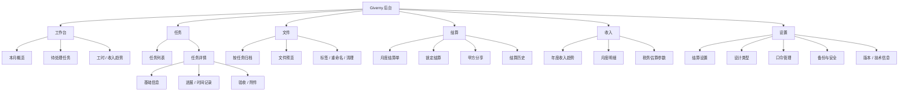

# Giverny 产品 / UX / UI 全面审查报告

审查时间：2026-06-13 18:19  
审查版本：v0.10.7  
审查范围：后台工作台、任务、文件库、收入、月报、设置、甲方分享路径  
执行原则：预发布测试站及其 D1/R2 资源已删除；优化先完成本地验证，再同步 production。

## 0. 总结判断

Giverny 当前已经具备一个试运营后台产品的核心闭环：任务记录、工时统计、文件归档、月报锁定、甲方分享、收入估算和权限管理。整体方向正确，视觉风格也在向“安静、轻量、工具化”收敛。

主要体验问题不在功能缺失，而在信息密度、重复入口、设置页过长、关键流程提示不足，以及部分页面仍把低频信息常驻展示。下一步应以“减少常驻控件、强化核心路径、折叠低频内容、统一组件规范”为主。

## 一、信息架构审查

### 当前问题清单

1. 工作台与任务页功能边界略重叠  
工作台有任务列表、搜索、筛选、右侧任务详情、上传附件和动态时间轴；任务页也有任务列表、筛选、详情编辑、进展。工作台应偏“看状态 + 快速处理”，任务页应偏“维护任务完整信息”。

2. 文件库命名偏技术  
“R2 文件库”对开发者清晰，但对日常使用者不如“文件库 / 交付文件”直观。R2 可以留在设置或说明里，不建议作为页面主标题。

3. 设置页信息层级过平  
口令管理、设计类型、结算设置、数据备份、版本、账号安全、Cloudflare 绑定全部平铺，首屏决策压力偏大。高频的结算设置和设计类型应优先，技术信息和安全信息应折叠。

4. 月报页流程和历史记录混在一个控制条中  
锁定结算、导出 PDF、预览甲方页面是核心流程；结算历史是复查功能。历史记录默认全部展开会挤压月报核对注意力。

5. 收入页“估算参数”偏专业  
税务信息对决策重要，但不应和收入趋势争抢注意力。默认应展示结果，参数折叠，用户需要时再展开。

6. 甲方查看入口在后台侧边导航中不可见但 AppView 存在  
当前通过月报页预览进入合理，不建议放入主导航。它是“流程结果页”，不是后台日常模块。

### 优化后的信息架构图



### 推荐页面层级结构

- 一级导航：工作台、任务、文件、结算、收入、设置。
- 工作台：概览卡片 → 待处理提醒 → 本月任务摘要 → 趋势图。
- 任务：列表 / 日历二级视图 → 右侧详情 → 信息 / 进展 / 验收。
- 文件：任务归档列表 → 文件网格 → 右侧检查器。
- 结算：当前月回单 → 操作条 → 历史记录折叠。
- 收入：年度趋势 → 月度明细 → 税务参数折叠。
- 设置：按业务设置、权限安全、系统信息分组折叠。

## 二、导航栏优化

### 当前问题

- “月报”更像结算工作流，建议命名为“结算”，贴近用户月底操作。
- 顶栏常驻“月度结算单”按钮与侧边“月报”重复，占据高价值区域。
- 文件库标题包含 R2，技术名词外露。
- 设置页低频功能过多，但侧边只显示“设置”，进入后层级不够。

### 新导航结构

一级导航建议：

- 工作台
- 任务
- 文件
- 结算
- 收入
- 设置

二级规划：

- 任务：列表视图、日历视图。
- 任务详情：信息、进展、验收。
- 文件：全部文件、按任务、标签筛选（后续）。
- 结算：当前结算单、结算历史、甲方预览。
- 设置：结算设置、设计类型、口令管理、备份与安全、版本信息。

### 导航优化建议

- 顶栏只保留“月份选择”和“新建任务”主按钮。
- “月度结算单”从顶栏移除，靠侧边“结算”进入。
- “月报”改名“结算”，减少财务流程理解成本。
- 文件页页面标题从“R2 文件库”改为“文件库”，副文案中说明来源即可。

## 三、内容折叠与展示策略

### 默认展开

- 工作台：本月核心统计、待处理提醒、任务摘要。
- 任务详情：基础信息中的核心字段、状态、进度。
- 月报：当前月结算单、锁定结算按钮。
- 文件库：任务归档列表、当前任务文件。

### 默认折叠

- 工作台：年度统计可默认保留，但不应抢占任务处理首屏；移动端应折叠。
- 任务详情：时间记录、附件上传、状态变更历史适合折叠。
- 月报：结算历史默认只显示最近一条，其余折叠。
- 收入：税务估算参数折叠。
- 设置：口令管理、Cloudflare 绑定、版本信息折叠。

### 适合 Tab

- 任务详情：信息 / 进展 / 验收。
- 任务页：列表 / 日历。
- 设置：业务设置 / 权限安全 / 系统信息（如果设置继续扩展）。

### 适合 Accordion

- 设置页所有分组。
- 月报结算历史。
- 任务详情中的时间记录、附件、状态原因。

### 适合分页或虚拟列表

- 文件库文件数量较多时，文件网格应分页或按任务懒加载。
- 审计动态超过 60 条时使用“加载更多”。
- 口令列表超过 20 条时分页或折叠过期口令。

## 四、按钮与交互设计审查

### 当前问题

- 工作台原本同时有筛选图标菜单和状态 Tab，属于重复操作。
- 顶栏“月度结算单”和侧边“月报”重复。
- 任务详情中状态下拉、快捷状态按钮、右键状态菜单并存，入口偏多。
- 设置页按钮类型混杂，危险操作、保存操作和普通操作需要更稳定的层级。

### 按钮体系规范

- 主按钮：每个视图最多 1 个，用于创建、锁定、确认验收、申请口令。
- 次按钮：用于导出、预览、取消、打开详情。
- 图标按钮：用于复制、打开、预览、删除、关闭。
- 危险按钮：删除、退出、停用等，必须有警示色或确认弹窗。
- 快捷菜单：右键菜单只放次级动作，不承载唯一关键路径。

### 页面按钮布局建议

- 顶栏：月份选择 + 新建任务。
- 工作台：任务筛选只保留一个可见入口，搜索与 Tab 同行。
- 任务详情：状态只保留下拉 + 关键按钮“确认验收”；其他状态可放入更多菜单或下拉。
- 文件库：右侧检查器保留图标按钮；删除走统一确认弹窗。
- 月报：锁定结算为主按钮，导出 PDF / 预览甲方页面为次按钮。

### 用户操作路径优化建议

- 新建普通任务：点击新建 → 填核心字段 → 创建。
- 补录已完成任务：打开补录 → 选结算月份 → 选已验收 → 填备注 → 创建 → 如需文件，进任务详情上传验收附件。
- 月底结算：进入结算 → 核对回单 → 锁定结算 → 复制链接。
- 清理误传文件：文件库 → 选择文件 → 删除 → 二次确认。

## 五、UI 视觉系统审查

### 当前视觉问题

- 色彩整体已经克制，但局部仍有多种绿色 / 灰绿色 / 黄棕并存，需要变量化。
- 字体层级基本稳定，但部分卡片标题和页面标题尺度接近，层级略粘。
- 间距存在 8、10、12、14、16、18、22、24、28 等多档，应收敛。
- 卡片过多时页面仍有“后台仪表盘堆叠感”，需要更多分组折叠而不是继续加卡。
- 图标风格统一使用 lucide，方向正确；需要统一尺寸与按钮容器。
- 视觉层级中“趋势图/年度统计”等分析信息有时与“待处理任务”同级，工作优先级不够突出。

### 改进建议

- 建立 CSS 变量：`--color-text`、`--color-muted`、`--color-surface`、`--color-border`、`--color-primary`、`--space-2/3/4/5`。
- 保持 8px 圆角为主，避免新增大圆角和阴影。
- 统一按钮高度：主/次按钮 42px，紧凑按钮 34px，图标按钮 36/42px 两档。
- 统一卡片内边距：普通 18px，密集 14px，大型票据单独处理。
- 页面标题只在顶栏出现一次；卡片标题 16-18px，避免和页面标题竞争。
- 默认少用装饰性颜色点，除非颜色承载状态或类型含义。

### UI 优化示意方案

```text
顶栏
[当前页面标题]                         [月份] [新建任务]

工作台
[本月总工时] [计费工时] [预计收入] [待处理]

待处理任务
[搜索] [全部][计划中][进行中][待验收][已验收]
任务列表 + 右侧摘要

洞察（默认次级）
[设计类型分布] [工时趋势]
[年度统计，可折叠]
```

## 六、UX 评估

### 首次访问

优点：登录页说明了管理员和访问口令区别。  
风险：对“甲方请使用分享链接”的说明存在，但如果甲方误进后台，仍可能不知道链接从哪里来。  
建议：后台登录页保持简洁；甲方入口不需要按钮，避免权限混淆。

### 登录 / 注册

当前无注册流程，符合个人工具定位。  
访问口令登录“邮箱留空”规则需要持续保留占位提示。  
风险点：管理员邮箱固定，密码在 secret；不适合公开多人注册。

### 浏览核心内容

工作台能快速看到核心数据，但信息过密：统计、提醒、任务、图表、年度统计、右侧详情都在一屏或连续区域中。  
建议：工作台突出“今天/本月要处理什么”，图表作为洞察次级展示。

### 搜索内容

任务搜索和文件搜索都有入口。  
问题：工作台和任务页搜索范围不完全一致，但 UI 命名都叫搜索，用户可能不知道搜索范围。  
建议：占位文案更明确，例如“搜索本月任务”与“搜索全部任务、需求、对接人”。

### 使用核心功能

新建任务流程已明显改善。  
补录流程现在更清晰，但验收文件仍需创建后上传，建议持续在提示中明确。  
确认验收流程功能完整，但时间段、附件、备注都在一个弹窗中，视觉压力偏大。

### 用户可能困惑的位置

- “月报”和“月度结算单”两个入口关系。
- 文件库标题中的 R2。
- 任务状态入口过多：下拉、快捷按钮、右键菜单。
- 设置页 Cloudflare 绑定对普通日常使用没有意义。
- 收入页税务参数默认展开会让非财务用户紧张。

### 跳出 / 转化风险点

- 月底结算时，如果历史记录过长，用户可能忽略当前回单核对。
- 新建任务弹窗字段较多，低频字段应该按补录 / 验收状态才出现。
- 任务详情信息太多时，用户可能不知道“下一步该做什么”。

## 七、优化实施计划

| 优先级 | 问题 | 建议 | 难度 | 工作量 | 用户收益 |
|---|---|---|---|---|---|
| P0 | 工作台重复筛选入口 | 保留状态 Tab，移除筛选图标菜单 | 低 | 0.5h | 减少决策成本 |
| P0 | 顶栏结算入口重复 | 顶栏移除“月度结算单”，侧边“月报”改“结算” | 低 | 0.5h | 导航更清晰 |
| P0 | 弹窗 / 浮层层级需统一 | 统一 z-index token | 中 | 1h | 避免遮罩穿透类问题 |
| P1 | 设置页过长 | 改为 Accordion 分组 | 中 | 2-3h | 降低设置页噪音 |
| P1 | 月报历史常驻 | 默认展示最近一条，其余折叠 | 中 | 1-2h | 聚焦当前结算 |
| P1 | 收入页税务参数过重 | 默认折叠参数，仅展示结果 | 中 | 1h | 提升阅读效率 |
| P1 | 任务详情状态入口过多 | 保留状态下拉 + 确认验收主按钮 | 中 | 1-2h | 降低误操作 |
| P2 | 抽组件 | IconButton / SegmentTabs / PanelHeader | 中 | 3-5h | 降低维护成本 |
| P2 | 文件库扩展 | 标签筛选、归档、分页 | 中高 | 3-6h | 文件量增长后更稳 |
| P2 | 自动化测试 | 覆盖补录、锁定、删除、分享 | 中高 | 4-8h | 提升上线信心 |

## 八、本轮直接执行

本轮先执行低风险 P0：

- 修改内容：移除工作台任务明细右上角的筛选图标菜单，保留下方状态 Tab。
- 修改原因：同一筛选功能同时存在两套入口，用户会困惑“哪个才是主筛选”。
- 修改前：搜索框旁有筛选图标，下面又有全部 / 计划中 / 进行中等 Tab。
- 修改后：工作台只保留搜索框 + 状态 Tab，入口唯一。
- 预期效果：减少视觉噪音和重复点击路径，让筛选行为更直接。

继续执行第二个低风险 P0：

- 修改内容：侧边导航“月报”改名为“结算”，顶栏移除重复的“月度结算单”按钮。
- 修改原因：结算是业务动作，“月报”只是产物；顶栏重复入口会分散新建任务这个高频主操作。
- 修改前：左侧有“月报”，顶栏还有“月度结算单”。
- 修改后：左侧为“结算”，顶栏只保留月份选择和“新建任务”。
- 预期效果：导航语义更贴近日常工作流，顶部操作更聚焦。

继续执行 P1：

- 修改内容：结算历史默认只展示最近一条，多条历史通过按钮展开 / 收起。
- 修改原因：结算页的首要任务是核对当前月结算单并锁定，历史记录是复查信息，不应默认抢占注意力。
- 修改前：所有结算历史常驻展开。
- 修改后：默认显示最近一条，用户需要时展开全部。
- 预期效果：当前结算流程更聚焦，页面阅读负担降低。

未执行到 production。后续如需上线，应完成本地验证后直接部署正式站。
